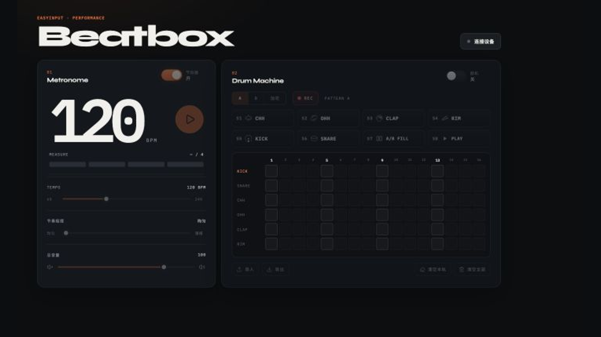
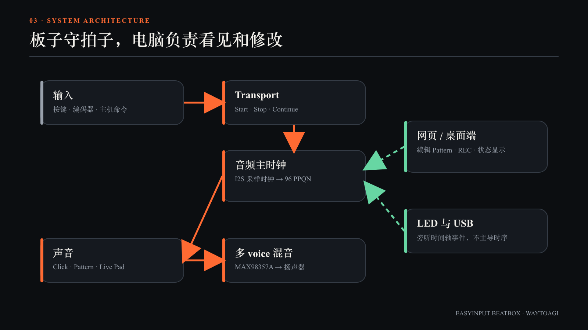

# EasyInput Beatbox

基于 EasyInput V2.0 与 ESP32-S3 制作的独立节拍器 / 鼓机：板端负责稳定走拍、实时发声和现场演奏，电脑端负责可视化、Pattern 编辑、叠录与同步。

> 板子守着拍子和声音。电脑只负责看见、改谱、同步。



## 项目是什么

EasyInput Beatbox 不是一个把按键事件发送给电脑后才发声的控制器，也不是浏览器里的节拍器网页。拔掉电脑后，开发板仍能独立完成节拍调度、声音播放、灯光反馈和 Live Pad 演奏；连接电脑后，网页或桌面应用会成为它的可视化编辑器。

| 阶段 | 目标 | 可验收的结果 |
| --- | --- | --- |
| P0 | 安全上电与第一声 click | RGB 正常点亮，扬声器播放短 click |
| P1 | 独立节拍器 | 编码器调 BPM，按键启停，灯光与声音同步 |
| P2 | 鼓机与音序器 | 六种鼓音、八键演奏、16 步、A/B、Fill、Swing |
| P3 | 电脑联动 | Pattern 编辑、状态同步、网页 REC 叠录与 MIDI 语义映射 |

核心原则是先建立可信的音频时间轴，再在同一时间轴上增加 click、Pattern、Live Pad、灯光和主机同步。

## 当前能力

- 60–240 BPM 独立节拍器，默认 120 BPM；编码器和 S8 均可控制播放。
- Click 与 Drum Pattern 是两个独立播放层，可以同时启用；Live Pad 不依赖 Pattern 开关。
- I2S `32 kHz` 采样时钟驱动内部 `96 PPQN` 时间轴，不用普通 `delay()` 推进节拍。
- 六种鼓音：Kick、Snare、Closed Hi-hat、Open Hi-hat、Clap、Rimshot。
- 4×2 实体键位、六轨 × 16 步 Pattern、A/B Variation、Fill 与 50%–75% Swing。
- 多 voice 混音；Live Pad 不会因为触发新音符而粗暴截断前一个声音。
- 网页端节拍器面板、实体键位映射、16 步编辑器、Pattern JSON 导入与导出。
- 网页 REC 叠录：边播边打，把演奏量化写入当前 A/B Pattern，而不是录制麦克风音频。
- USB Serial 双向同步、自动重连、Pattern revision 冲突处理。
- MIDI Clock、运输控制和 GM Channel 10 语义映射；当前传输层仍是易调试的 JSON Lines。

## 系统架构



节拍与声音对实时性要求最高，因此由开发板独立完成。网页刷新、USB 收包或 LED 更新不能改变声音的触发时刻。

- **板端**：读取按键与编码器，维护 Start / Stop / Continue，运行 I2S 音频时钟、Pattern、Live Pad 与多 voice 混音。
- **电脑端**：展示状态、编辑 Pattern、控制录音武装、导入导出数据。
- **LED 与 USB**：消费时间轴事件用于显示和同步，不反过来驱动音频时序。

当前使用 **USB Serial + Web Serial** 作为稳定主通道。消息表达的是音符、运输、BPM、Pattern 和位置等领域语义，可以映射为 MIDI，但 JSON 消息本身并不是 MIDI 字节。

## 硬件交互

| 操作 | 行为 |
| --- | --- |
| 旋转编码器 | 调整 BPM，范围 60–240 |
| 短按编码器或 S8 | Play / Stop |
| S1 | Closed Hi-hat（GM 42） |
| S2 | Open Hi-hat（GM 46） |
| S3 | Clap（GM 39） |
| S4 | Rimshot（GM 37） |
| S5 | Kick（GM 36） |
| S6 | Snare（GM 38） |
| S7 短按 | 切换 Pattern A / B |
| S7 长按 | 按住进入 Fill，松开返回 |

五颗 RGB LED 用来表示拍点、重拍和运行状态。麦克风目前不进入实时音频链路。

## 快速开始

### 需要准备

- EasyInput V2.0 开发板；
- 支持数据传输的 USB-C 线；
- ESP-IDF 5.4.1，目标芯片为 `esp32s3`；
- Node.js 与 pnpm；
- Chrome 或 Edge（使用网页版本时）。

### 构建与烧录固件

```bash
cd firmware
. ~/esp/v5.4.1/esp-idf/export.sh
idf.py set-target esp32s3
idf.py build
```

开发板保持开机，短按一次 BOOT 并松开；电脑出现 ESP32-S3 下载端口后执行：

```bash
idf.py -p /dev/cu.usbmodem* flash
```

烧录完成后关闭开发板电源，再重新开机。端口名称会随电脑环境变化，不要把某一个 `usbmodem` 编号写死。

### 启动网页应用

回到仓库根目录：

```bash
pnpm install
pnpm dev
```

使用 Chrome 或 Edge 打开终端显示的本地地址，点击“连接设备”，并在串口授权窗口中选择 Espressif 设备。应用收到设备的 `hello` 与 `state` 后进入同步状态。

运行网页测试：

```bash
pnpm test
```

### 启动桌面应用

macOS 系统 WebView 不提供 Web Serial，因此桌面版本使用 Electron 封装网页应用。

```bash
# 终端 1：启动网页开发服务器
pnpm dev

# 终端 2：启动 Electron
pnpm desktop:dev
```

也可以构建网页后直接加载：

```bash
pnpm desktop:start
```

## Pattern 与叠录

Pattern 由六条鼓轨和十六个 Step 组成。A、B 是两份完整 Pattern；Fill 是按住 S7 时临时覆盖的加花谱。

网页中的 REC 不会录制音频波形。录音武装后，实体 Pad 仍由板端立即发声，同时将 note 事件发送给网页；网页根据当前位置量化到最近的 Step，再写回当前 A/B Pattern。已有格子会保留，因此可以边播边叠加新的鼓层。

Pattern 支持 JSON 导入与导出，适合保存、分享或版本管理节奏数据。

## 为什么暂时不是 USB MIDI Class

ESP32-S3 的原生 USB PHY 同时承担烧录、Serial/JTAG 与 USB MIDI Class 需求。在当前 macOS 链路中，直接切换到 TinyUSB MIDI 会带来枚举与烧录稳定性问题。

因此本项目采用两层设计：

1. 先稳定产品语义：音符、Clock、Start / Stop / Continue、BPM、Pattern 和位置；
2. 当前用 USB Serial + JSON Lines 承载，未来满足门槛后可以替换为 USB MIDI Class 或桌面桥接。

设备管理命令不会用不存在的“标准 CC”假装实现 BPM 或 Pattern。详细决策见 [`docs/usb-midi-spike.md`](docs/usb-midi-spike.md)。

## 仓库结构

```text
easyinput-beatbox/
├── firmware/          ESP-IDF 固件
│   └── main/
│       ├── board/     按键、板级常量与共享电源
│       ├── audio/     I2S、click、采样播放与混音
│       ├── seq/       时钟、Pattern 与音序器
│       ├── ui/        RGB 状态显示
│       └── host/      USB Serial 主机协议
├── app/               Vite + Web Serial 网页应用
├── desktop/           Electron 桌面封装
├── assets/samples/    鼓组采样资源
├── docs/              产品、协议与课程文档
└── scripts/           检查与辅助脚本
```

## 文档导航

- [完整制作讲义](docs/course/waytoagi-making-process.md)：从识别硬件到节拍器、鼓机、网页联动和 MIDI 语义的完整实操流程。
- [课程 PPT 分页稿](docs/course/waytoagi-ppt-outline.md)：90–120 分钟课程的页面结构和讲师口播。
- [产品合同](docs/product-contract.md)：音色、时钟、交互、连接和阶段目标。
- [主机协议](docs/host-protocol.md)：USB Serial JSON Lines 消息与同步规则。
- [MIDI 语义](docs/midi-protocol.md)：Clock、运输控制、GM Channel 10 与设备管理命令。
- [USB MIDI 可行性记录](docs/usb-midi-spike.md)：为什么当前保留 Serial，以及替换运输层需要满足的门槛。

## 开发与验收

```bash
pnpm build
pnpm test
./scripts/check_board_baseline.sh
./scripts/check_timing_model.py
```

静态检查通过不等于真机验收完成。发声、灯光、60/120/240 BPM、Swing、长时间漂移、USB 插拔和 Pattern 同步仍应在真实硬件上验证。

## AI / Agent 协作

项目把两类知识分开维护：板级资料描述引脚、电源、信号方向等不可随意改变的事实；Beatbox 产品约定描述键位、节拍、Pattern 与协议等产品行为。

```bash
./scripts/setup_skills.sh
```

修改硬件脚位、BOOT、GPIO8 或外设代码前，应先核对开发板资料；修改键位、BPM、Pattern 或协议时，以 Beatbox 产品约定为准。

## 许可

本项目代码采用 [MIT License](LICENSE) 开源。

仓库中来自第三方的图标、音频采样及其他素材，继续遵循其所在目录中标注的原始许可条款。
